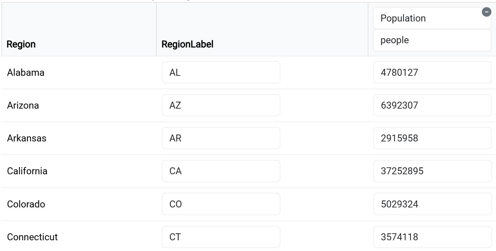

# Quick Start

The easiest way to create your first cartogram is by modifying one of our examples. Follow this step-by-step guide:

1. Navigate to https://go-cart.io/cartogram
2. Select one of our examples from the dropdown box at the top-left under our logo
3. Click the **Edit :far fa-edit:** button on the top-right
4. Edit `RegionLabel` and `Population` values in the right panel table
   - Optional:
     - Rename data columns (e.g., "Population" → "GDP")
     - Adjust measurement units

5. Click the **Generate** button (bottom of right panel)
6. Wait for cartogram generation to finish
7. Click the <i class="fas fa-download"></i> icon (bottom-right of cartogram) to export your cartogram to svg or geojson file

Congratulations on creating your first cartogram via go-cart.io! For advanced customization, see our [Tutorials](/tutorials) section.
