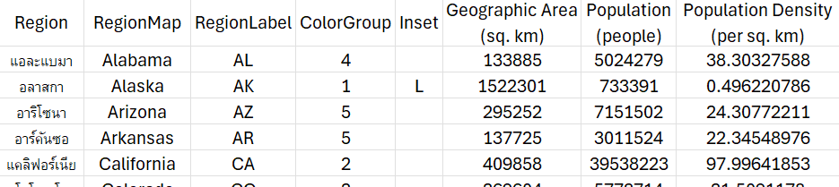
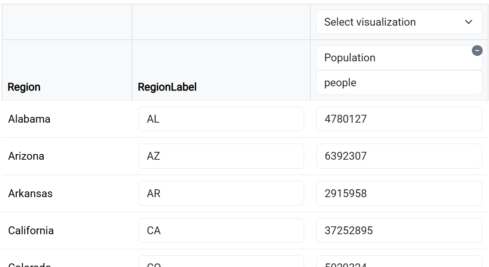

# go-cart.io: Online Web Interface for cartogram generator

Go-cart.io is a web-based cartogram generator. To get started:

1. Visit [https://go-cart.io/create](https://go-cart.io/create)
2. Follow the steps in the left panel
3. Refer to this tutorial for detailed explanations

This guide walks you through each step of the process.

## 1. Define a map

**Choose one method:**

- Select a predefined map from the dropdown OR
- Upload your own boundary file:
  - Supported formats: GeoJSON (.geojson) or Shapefile (.shp with .shx/.dbf in a ZIP)

**Important requirements:**

- Files must contain valid geometries (no self-intersections)
- Use [Mapshaper](https://mapshaper.org/) to validate and repair files
- Region names must be unique (e.g., represent Indonesia as one MultiPolygon, not separate Polygons)

After select or upload the map, you'll see a spreadsheet to input your data.

## 2. Input your data

You can edit your data in two ways:

1. **Download Spreadsheet**
   Best for larger or complex edits. Open with Excel or LibreOffice.

2. **Web Interface**
   Best for quick adjustments.

We recommend downloading the spreadsheet (CSV or Excel), editing it on your device, and then re-uploading it. After uploading, check the preview panel to verify your data. Use the web interface for minor edits.

If you already have a prepared file, you can upload it directly — just make sure to resolve any issues that appear.

### Data Structure

The spreadsheet contains **restricted columns** (used for visualization settings) followed by your **data columns**.

Example:



In this example, there are two data columns:

- Population (people)
- Population density (per sq. km)

Each data column must have a unique name and a unit in the header. These can later be used for visualizations (e.g., cartogram or choropleth).

### Restricted Columns

| Column                     | Purpose                                  | Format        | Notes                                                                                                                               |
| -------------------------- | ---------------------------------------- | ------------- | ----------------------------------------------------------------------------------------------------------------------------------- |
| `Region`                   | Region name shown in tooltip             | Text          | **Required**, must be unique                                                                                                        |
| `RegionMap`                | Matches region name in the boundary file | Text          | Optional, useful when renaming many regions                                                                                         |
| `RegionLabel`              | Label displayed on the map               | Text          | Optional, automatically scaled                                                                                                      |
| `ColorGroup`               | Assigns color groups                     | Number        | Auto-calculated if empty (ignored if `Color` is provided)                                                                           |
| `Color`                    | Custom colors                            | HEX (#RRGGBB) | Required for “Custom” scheme, see [HEX reference](https://appendto.com/2017/02/rgb-to-hex-understanding-the-major-web-color-codes/) |
| `Inset`                    | Inset positioning                        | L/R/T/B       | Options: Left (L), Right (R), Top (T), Bottom (B), or leave blank                                                                   |
| `Geographic Area (sq. km)` | Region’s area in sq. km                  | Number        | Auto-calculated if not provided                                                                                                     |

⚠️ **Important:** Do not rename these headers:
`RegionMap`, `RegionLabel`, `Color`, `ColorGroup`, `Inset`, `Geographic Area (sq. km)`

### Uploading Your Own File

If you upload an existing spreadsheet instead of using our template:

- Make sure it contains at least one column with region names.
- If no `Region` column is found, the web interface will ask you to select the column that matches region names.
- If there are mismatched names between your file and the map, you can choose to:
  - Keep the name from the map
  - Drop the unmatched region
  - Rename the map region to match your data

💡 If you need to rename many regions, consider adding a `RegionMap` column for convenience.

Here’s a refined and simplified version of your tutorial text:

## 3. Specify Visualization

First, set up the basics:

- **Title**: Give your project a name.
- **Insets** (recommended for maps with islands/separate regions):
  - When enabled, regions are processed separately and then merged.
  - Use the `Inset` column to define positions: `L` (Left), `R` (Right), `T` (Top), or `B` (Bottom).

Next, in the **Input Overview** panel, choose a visualization method for each data column:



Once selected, you can configure settings for **maps/cartograms** and **choropleths**.

### Choosing the Right Visualization

Cartograms are designed to visualize totals, not indices. As a rule of thumb: if a dataset is well-suited for a pie chart or mosaic plot, then it is also suitable for a cartogram.

On the other hand, choropleths are best for visualizing ratios, proportions, or indices (e.g., percentages, densities, composite scores). They color each region according to the value of the statistic, making them more effective for comparisons based on normalized data.

Refer to the table below for examples:

| Cartogram                            | Choropleth                                                                                             |
| ------------------------------------ | ------------------------------------------------------------------------------------------------------ |
| Total GDP by region                  | [Human Development Index](https://en.wikipedia.org/wiki/Mosaic_plot) (or similar composite statistics) |
| Total population by region           | Population density by region                                                                           |
| Number of college gradates by region | Percentage of population that are college graduates by region                                          |

For some datasets, the algorithm may not be able to compute a cartogram:

- **Contiguous cartograms**: Problems occur when the target areas imply extreme distortions. For example, setting the Vatican City to be as large as Russia, or giving a large region a target area of zero, makes it impossible to preserve topology. In such cases, a contiguous cartogram may not be suitable.

- **Non-contiguous cartograms**: Our current algorithm struggles with very small regions. Since the smallest region limits the scaling, the output may contain excessive white space. We are working on improvements to address this issue.

If you come across a better algorithm and would like us to integrate it, please contact us—we’re happy to collaborate!

### Map / Cartogram

You can color regions in two ways:

1. **Preset color schemes** – automatically apply selected schemes to all regions.
2. **Custom colors** – assign manually using HEX codes.

For custom colors, go back to **Step 2** and edit the `Color` column in your spreadsheet.

### Choropleth (Basic Mode)

You can adjust:

- Color scale
- Scale type
- Number of steps

These apply to all choropleths in **basic mode**.

If you want more control (e.g., different colors per dataset), switch to **advanced mode**.

### Choropleth (Advanced Mode)

In advanced mode, you can define a scale for each column using a [Vega specification](https://vega.github.io/vega/docs/scales/) as well as customize legend titles.

Basic structure:

```json
{
  "scales": [
    {
      "name": "<data column name>",
      "type": "<scale type>",
      ...
    }
  ],
  "legend_titles": {
    "<data column name>": "<legend title>"
  }
}
```

- The `name` and `legend_titles` keys must match your data column names.
- Each choropleth column needs its own scale.
- Use `source_csv` as the data source (it refers to the spreadsheet in Step 2).

Example with two data columns:

```json
{
  "scales": [
    {
      "name": "Population density (per sq. km)",
      "type": "quantile",
      "domain": {
        "data": "source_csv",
        "field": "Population density (per sq. km)"
      },
      "range": {
        "scheme": "blues",
        "count": 5
      }
    },
    {
      "name": "Crime rate (%)",
      "type": "threshold",
      "domain": [0, 100],
      "range": ["red", "white", "blue"]
    }
  ],
  "legend_titles": {
    "Population density (per sq. km)": "Population density (quintiles)",
    "Crime rate (%)": "Crime Rate"
  }
}
```

## 4. Generate visualization

1. Click the **"Generate"** button
2. Wait for processing (typically completes in seconds)
3. You'll be automatically redirected to the map visualization viewer
4. Download or share your visualization
   - Click the :fas fa-download: button to download:
     - SVG (vector, editable)
     - GeoJSON (geospatial data)
   - Click the **Share** button (:fas fa-share-alt:) to:
     - Generate a shareable link
     - Get embed code for websites

⚠️ **Important notes about your data**:

- Unshared visualization are automatically deleted from our servers after **1-2 days**
- Shared links remain active for **1 year** from last access
  - _Example_: Regular access keeps data available indefinitely
- **No absolute guarantee** - always keep backup copies of:
  - Your original boundary files
  - Data spreadsheets

## FAQs

### How does this website generate contiguous cartograms?

This website uses the Fast Flow-based method developed by Michael T. Gastner, Vivien Seguy, and Pratyush More. You can learn more about how this method works by reading [the paper](https://www.pnas.org/content/115/10/E2156) they published in the journal PNAS. If you publish an image produced by go-cart.io, please include a reference to the PNAS paper.

### How long does it take to generate a visualization?

It usually takes just a few seconds to generate one visualization using this website. It will take longer if you have multiple data columns. A progress bar will give you an indication of how far the calculation has already proceeded.

### Can I share images created by go-cart.io with others?

Yes. Images generated by go-cart.io can be distributed under a permissive liccense (CC-BY, see [Creative Commons license](https://creativecommons.org/licenses/)): "This license lets others distribute, remix, adapt, and build upon your work, even commercially, as long as they credit you for the original creation." Please read about how credit our work [here](/licenses).

### How can I download and edit the visualization generated on this website?

Below each map or cartogram displayed on this website there is a download button. By clicking it, you can download an SVG image. SVG files contain vector images, and can be edited and converted by Adobe Illustrator or [Inkscape](https://inkscape.org/), a free, open source alternative. If you would simply like to convert your SVG map to a PNG image to use in a document or paper and don’t have access to these programs, you can use [this website](https://svgtopng.com/).
